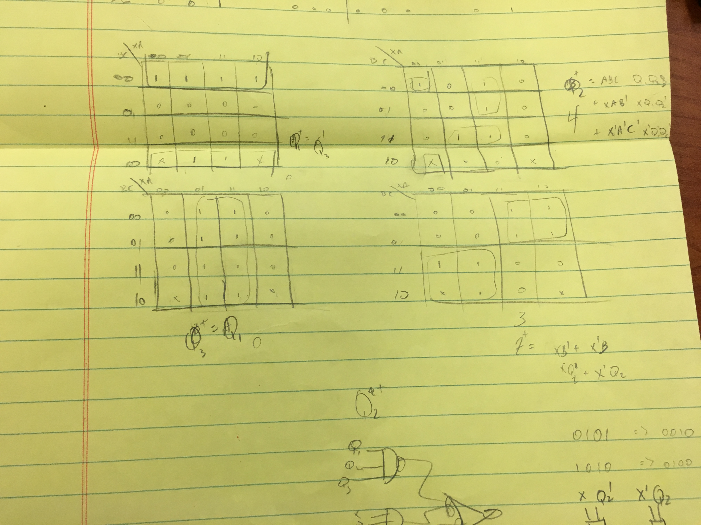

# Lab 5 Report

* Jeremy Castillo
* jcc4428
* 16055
* 16.3

### Answers to Prep Questions

This state graph is for the case where the output is not complemented. So each output was complemented in the state table to get achieve the assigned task.

Binary Assignment by hand.

State Assignment by hand.

Binary assignment reduced equations by logic aid. Match ones above by hand.

Chosen state assignment reduced equations by logic aid. Match ones above by hand.

