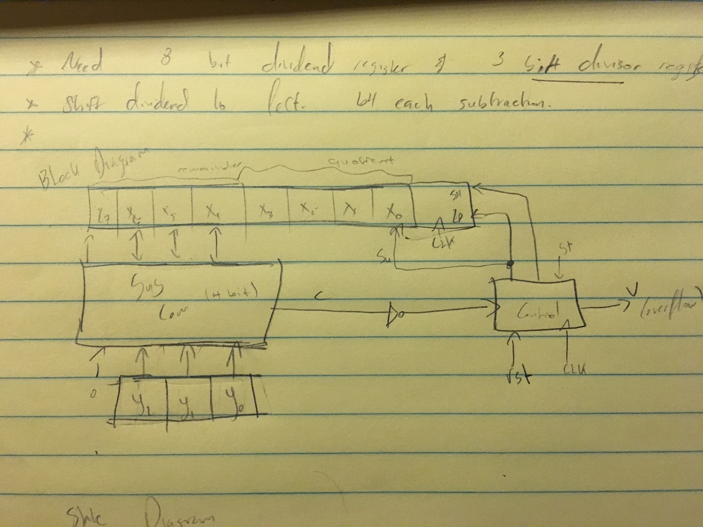
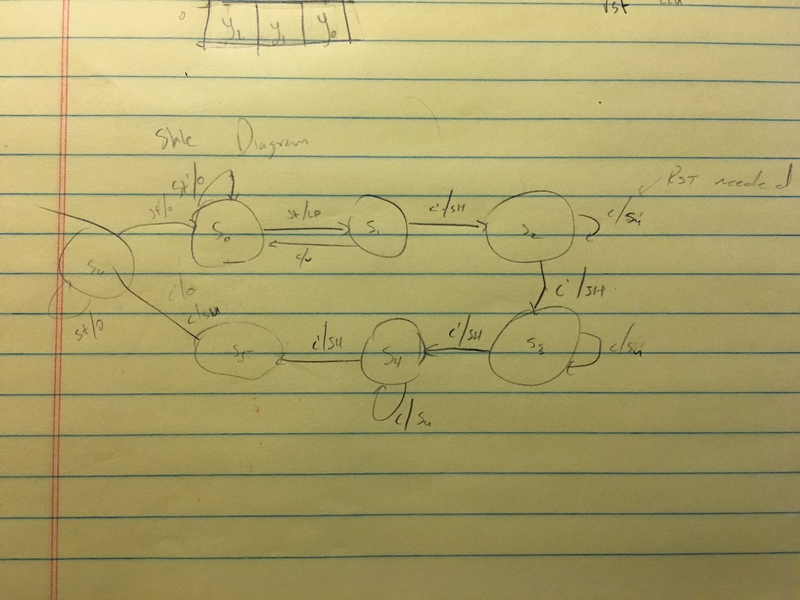
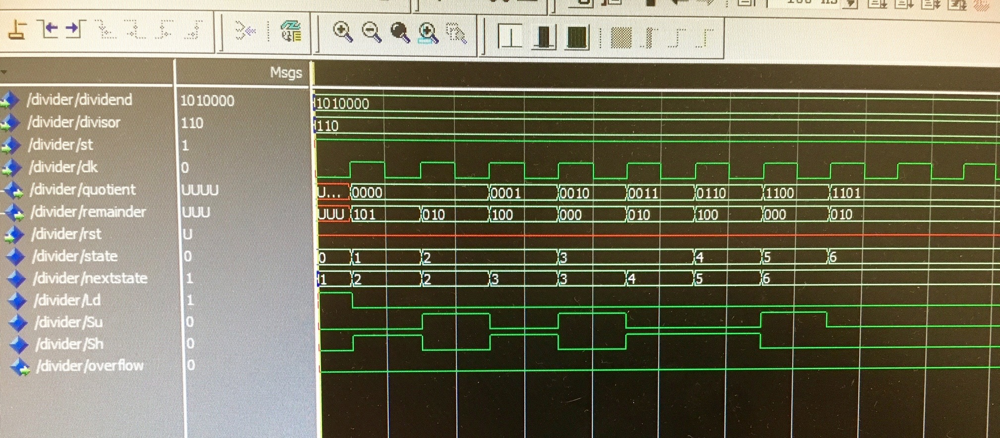
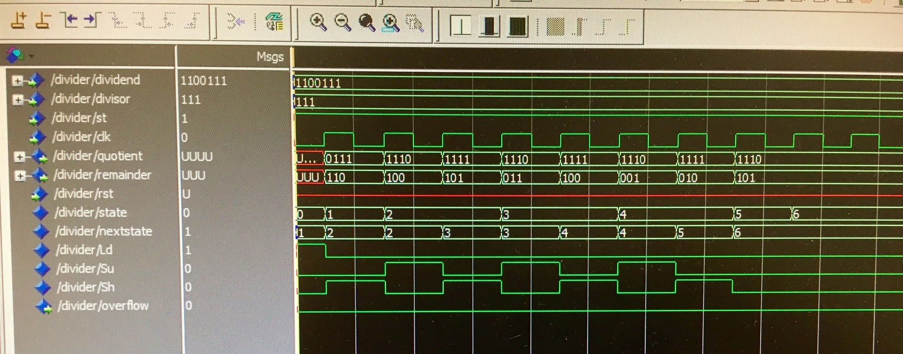
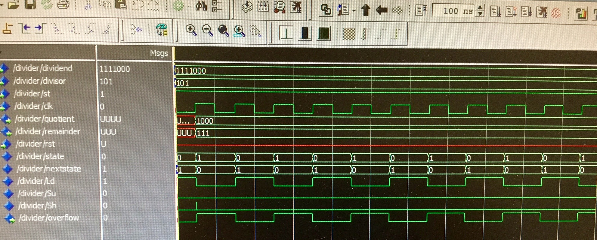
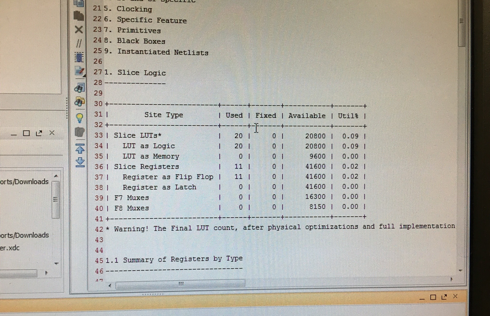

# Lab 7 Report

* Jeremy Castillo
* jcc4428
* 16055
* 20.A

Block Diagram for divider




State graph for divider



```vhdl
library IEEE;
use IEEE.STD_LOGIC_1164.all;
use IEEE.STD_LOGIC_ARITH.all;
use IEEE.STD_LOGIC_UNSIGNED.all;

entity divider is
    port(dividend: in std_logic_vector(6 downto 0);
         divisor: in std_logic_vector(2 downto 0);
         st, clk: in std_logic;
         quotient: out std_logic_vector(3 downto 0);
         remainder: out std_logic_vector(2 downto 0);
         overflow: out std_logic;
         rst: in std_logic;
         done: out std_logic
         );
end divider;

architecture structure of divider is
    signal state, nextstate: integer range 0 to 6;
    signal C, Ld, Su, Sh: std_logic;
    signal sout: std_logic_vector(3 downto 0);
    signal dividend_register: std_logic_vector(7 downto 0);

begin
    sout <= dividend_register(7 downto 4) - ('0' & divisor);
    C <= not sout(3);
    remainder <= dividend_register(6 downto 4);
    quotient <= dividend_register(3 downto 0);

State_Graph: process(state, st, C, rst)
begin
    Ld <= '0'; overflow <= '0'; Sh <= '0'; Su <= '0'; done <= '0';
    if(rst = '1') then nextstate <= 0;
    else
        case state is
            when 0 =>
                if(st = '1') then Ld <= '1'; nextstate <= 1;
                else nextstate <= 0; end if;
            when 1 =>
                if(C = '1') then overflow <= '1'; nextstate <= 0;
                else Sh <= '1'; nextstate <= 2; end if;
            when 2 | 3 | 4 =>
                if(C = '1') then Su <= '1'; nextstate <= state;
                else Sh <= '1'; nextstate <= State + 1; end if;
            when 5 =>
                if(C = '1') then Su <= '1'; end if;
                nextstate <= 6;
            when 6 =>
              if(st = '1') then nextstate <= state; done <= '1';
              else nextstate <= 0; done <= '0'; end if;
        end case;
    end if;
end process State_Graph;

update: process(Clk)
begin
    if Clk'event and Clk = '1' then -- rising edge of clock
        state <= nextstate;
        if Ld = '1' then dividend_register <= '0' & dividend; end if;
        if Su = '1' then dividend_register(7 downto 4) <= sout; dividend_register(0) <= '1'; end if;
        if Sh = '1' then dividend_register <= dividend_register(6 downto 0) & '0'; end if;
    end if;
end process update;

end structure;
```

Waveform for test sequence
    
    Dividend 1100111
    Dividsor 111



Waveform for test sequence
    
    Dividend 1010000
    Dividsor 110



Waveform for test sequence
    
    Dividend 1111000
    Dividsor 101



Screenshot of VHDL Synthesis Report



```
## This file is a general .xdc for the Basys3 rev B board
## To use it in a project:
## - uncomment the lines corresponding to used pins
## - rename the used ports (in each line, after get_ports) according to the top level signal names in the project

## Clock signal
set_property PACKAGE_PIN W5 [get_ports clk]                         
    set_property IOSTANDARD LVCMOS33 [get_ports clk]
    create_clock -add -name sys_clk_pin -period 10.00 -waveform {0 5} [get_ports clk]
 
## Switches
set_property PACKAGE_PIN V17 [get_ports {dividend[0]}]                  
    set_property IOSTANDARD LVCMOS33 [get_ports {dividend[0]}]
set_property PACKAGE_PIN V16 [get_ports {dividend[1]}]                  
    set_property IOSTANDARD LVCMOS33 [get_ports {dividend[1]}]
set_property PACKAGE_PIN W16 [get_ports {dividend[2]}]                  
    set_property IOSTANDARD LVCMOS33 [get_ports {dividend[2]}]
set_property PACKAGE_PIN W17 [get_ports {dividend[3]}]                  
    set_property IOSTANDARD LVCMOS33 [get_ports {dividend[3]}]
set_property PACKAGE_PIN W15 [get_ports {dividend[4]}]                  
    set_property IOSTANDARD LVCMOS33 [get_ports {dividend[4]}]
set_property PACKAGE_PIN V15 [get_ports {dividend[5]}]                  
    set_property IOSTANDARD LVCMOS33 [get_ports {dividend[5]}]
set_property PACKAGE_PIN W14 [get_ports {dividend[6]}]                  
    set_property IOSTANDARD LVCMOS33 [get_ports {dividend[6]}]

set_property PACKAGE_PIN V2 [get_ports {divisor[0]}]                    
    set_property IOSTANDARD LVCMOS33 [get_ports {divisor[0]}]
set_property PACKAGE_PIN T3 [get_ports {divisor[1]}]                    
    set_property IOSTANDARD LVCMOS33 [get_ports {divisor[1]}]
set_property PACKAGE_PIN T2 [get_ports {divisor[2]}]                    
    set_property IOSTANDARD LVCMOS33 [get_ports {divisor[2]}]

set_property PACKAGE_PIN T1 [get_ports {st}]                    
    set_property IOSTANDARD LVCMOS33 [get_ports {st}]
set_property PACKAGE_PIN R2 [get_ports {rst}]                   
    set_property IOSTANDARD LVCMOS33 [get_ports {rst}]
 

## LEDs
set_property PACKAGE_PIN U16 [get_ports {quotient[0]}]                  
    set_property IOSTANDARD LVCMOS33 [get_ports {quotient[0]}]
set_property PACKAGE_PIN E19 [get_ports {quotient[1]}]                  
    set_property IOSTANDARD LVCMOS33 [get_ports {quotient[1]}]
set_property PACKAGE_PIN U19 [get_ports {quotient[2]}]                  
    set_property IOSTANDARD LVCMOS33 [get_ports {quotient[2]}]
set_property PACKAGE_PIN V19 [get_ports {quotient[3]}]                  
    set_property IOSTANDARD LVCMOS33 [get_ports {quotient[3]}]

set_property PACKAGE_PIN U15 [get_ports {remainder[0]}]                 
    set_property IOSTANDARD LVCMOS33 [get_ports {remainder[0]}]
set_property PACKAGE_PIN U14 [get_ports {remainder[1]}]                 
    set_property IOSTANDARD LVCMOS33 [get_ports {remainder[1]}]
set_property PACKAGE_PIN V14 [get_ports {remainder[2]}]                 
    set_property IOSTANDARD LVCMOS33 [get_ports {remainder[2]}]

set_property PACKAGE_PIN P1 [get_ports {overflow}]                  
    set_property IOSTANDARD LVCMOS33 [get_ports {overflow}]
set_property PACKAGE_PIN L1 [get_ports {done}]                  
    set_property IOSTANDARD LVCMOS33 [get_ports {done}]
    
```


