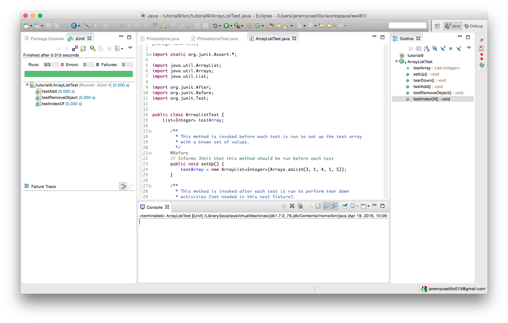
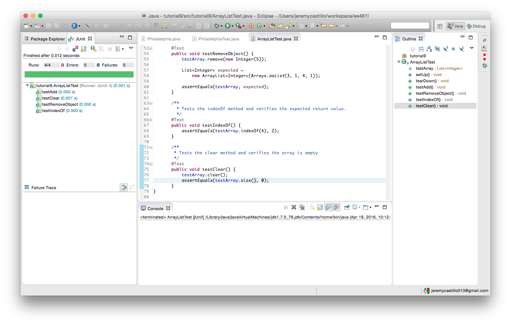

# Tutorial 9

* Jeremy Castillo
* Tutorial 9

## Exercise 1

1) Test has same output. 


2) The bar is red to indicate a failure and there is a failure trace to where the problem occured. 


3) Wrote a test to use assertNotNull.


```java
    @Test 
    public void testObjectCreation() {
        Philadelphia p = new Philadelphia();
        assertNotNull("hello", p);
    }
```

The test would check to see if the object was created and had a non null reference to the object.

4) Wrote test to thrown ArrayOutOfBoundsException.


```java
    @Test
    public void testException() {
        Philadelphia.isItSunnyArray();
    }

    public static int isItSunnyArray() {
        int a[] = {1, 2, 3};
        return a[4];
    }
```

The test throwns the exception because the operator[] is indexing outside of the allocated bounds of the array. The tests print out the stack trace once the line 
```java 
return a[4] 
```
is run.

## Exercise 2

1) Test has same output.



2) Wrote code to test clear method of ArrayList.



```java
/**
  * Tests the clear method and verifies the array is empty
  */
   @Test 
   public void testClear() {
       testArray.clear();
       assertEquals(testArray.size(), 0);
   }
```

3) Wrote code to test contains method of ArrayList when given value is present.


```java
   /**
    * Tests the contains method and verifies value is present.
    */
   @Test
   public void testContainsTrue() {
       assertEquals(testArray.contains(4), true);
   }
```

4) Wrote code to test contains method of ArrayList when given value is not present.


```java
   /**
    * Tests the contains method and verifies value is not present.
    */
   @Test
   public void testContainsFalse() {
       assertEquals(testArray.contains(100), false);
   }
```

5) Wrote code to test get method of ArrayList when given value is present.


```java
   /**
    * Tests get method when value is present.
    */
       @Test
       public void testGet() {
           int i = testArray.get(0);
           assertEquals(i, 3);
       }
```

## Exercise 3
Wrote two test suits to provide full statement, branch and path coverage.

```java
    @Test
    public void testParseTimeToSecondStmtBranchCoverage() {

        /**
         * The whole test suite covers all the statements by using try catches to execute
         * each of the exceptions.
         * The last two execute the statements related to am and pm in the time.
         */
        
        // bad time 1
        try {
            TimeParser.parseTimeToSeconds("12345");
        }
        catch(NumberFormatException e) {
            String msg = new String("Unrecognized time format 1");
            assertEquals(msg, e.getMessage());
        }
        
        // bad time 2
        try {
            TimeParser.parseTimeToSeconds("12:123");
        }
        catch(NumberFormatException e) {
            String msg = new String("Unrecognized time format 2");
            assertEquals(msg, e.getMessage());
        }
        
        // bad time 3
        try {
            TimeParser.parseTimeToSeconds("60:12:100 pm");
        }
        catch(IllegalArgumentException e) {
            String msg = new String("Unacceptable time specified");
            assertEquals(msg, e.getMessage());
        }
        
        // bad time 4
        try {
            TimeParser.parseTimeToSeconds("12:12:100 am");
        }
        catch(IllegalArgumentException e) {
            String msg = new String("Unacceptable time specified");
            assertEquals(msg, e.getMessage());
        }
        
        
        // good time 1
        assertEquals(47552, TimeParser.parseTimeToSeconds("1:12:32 pm"));
        
        // good time 2
        assertEquals(4352, TimeParser.parseTimeToSeconds("1:12:32 am"));
        
        // good time 3
        assertEquals(752, TimeParser.parseTimeToSeconds("12:12:32 am"));
    }
    
    @Test
    public void testParseTimeToSecondsPathCoverage() {
        
        /**
         * The whole test suite covers all the statements by using try catches to execute
         * each of the exceptions.
         * The last two execute the statements related to am and pm in the time.
         */
        
        // path with first bad time
        try {
            TimeParser.parseTimeToSeconds("12345");
        }
        catch(NumberFormatException e) {
            String msg = new String("Unrecognized time format 1");
            assertEquals(msg, e.getMessage());
        }
        
        // path with second bad time
        try {
            TimeParser.parseTimeToSeconds("12:123");
        }
        catch(NumberFormatException e) {
            String msg = new String("Unrecognized time format 2");
            assertEquals(msg, e.getMessage());
        }
        
        // path with pm in it but bad time 
        try {
            TimeParser.parseTimeToSeconds("60:12:100 pm");
        }
        catch(IllegalArgumentException e) {
            String msg = new String("Unacceptable time specified");
            assertEquals(msg, e.getMessage());
        }
        
        // path with am and twelve in it but bad time
        try {
            TimeParser.parseTimeToSeconds("12:12:100 am");
        }
        catch(IllegalArgumentException e) {
            String msg = new String("Unacceptable time specified");
            assertEquals(msg, e.getMessage());
        }
        
        
        // path with pm and good time
        assertEquals(47552, TimeParser.parseTimeToSeconds("1:12:32 pm"));
        
        // path with am and no 12
        assertEquals(4352, TimeParser.parseTimeToSeconds("1:12:32 am"));
        
        // path with am and twelve
        assertEquals(752, TimeParser.parseTimeToSeconds("12:12:32 am"));
    }
```

The first test suite covers all the statments by having try catches surround each of the cases where an exception may be thrown. The last three methods are where a good time string is provided to the function. 

## Exercise 4

Wrote test suite below to test the invariant of the heap where:
    array[n] <= array[2*n] AND array[n] <= array[2*n + 1]

The code written can be generalized to any size of a heap array. The invariant does not hold because the implementatin of heap array does not bounds check the get method. This allows index to grow outside of the length, but still be within the capacity. When the capacity space is accessed and not apart of the heap yet then the memory locations will have garbage (or null) in them.

```java
       @Test
       public void test1Invaraint2() {
           heap.add(0);
           heap.add(1);
           heap.add(2);
           assertTrue(invariant2());
       }

     
       private boolean invariant2() {
           for(int k = 0; k < heap.size()-1; k += 1) {
               if
               (!(
                   heap.get(k) <= heap.get(2*k) &&
                   heap.get(k) <= heap.get(2*k + 1)
               ))
               return false;
           }
           return true;
       }
```

